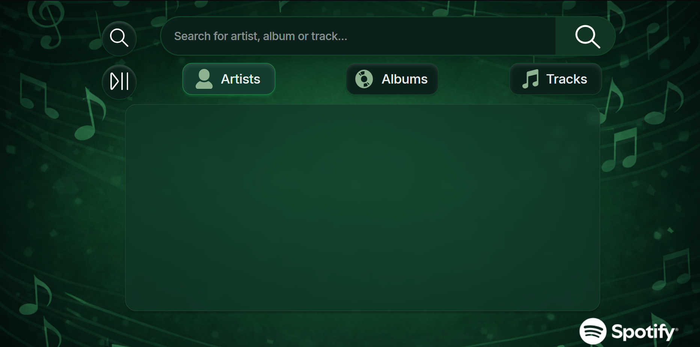
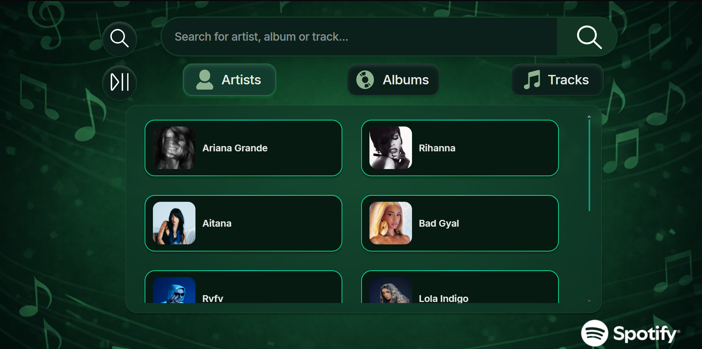
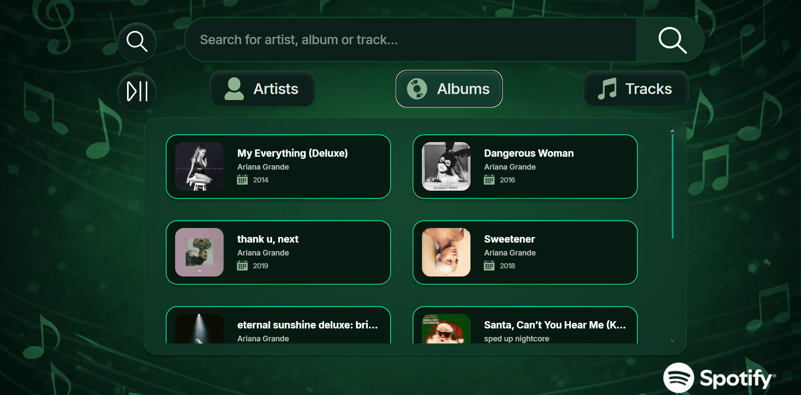
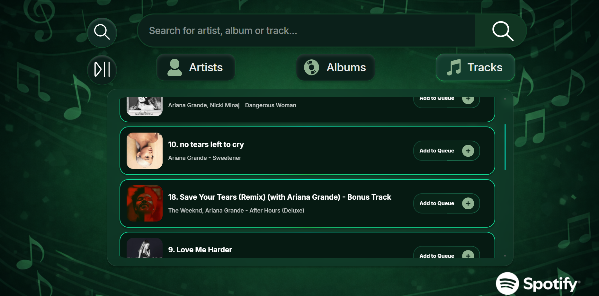
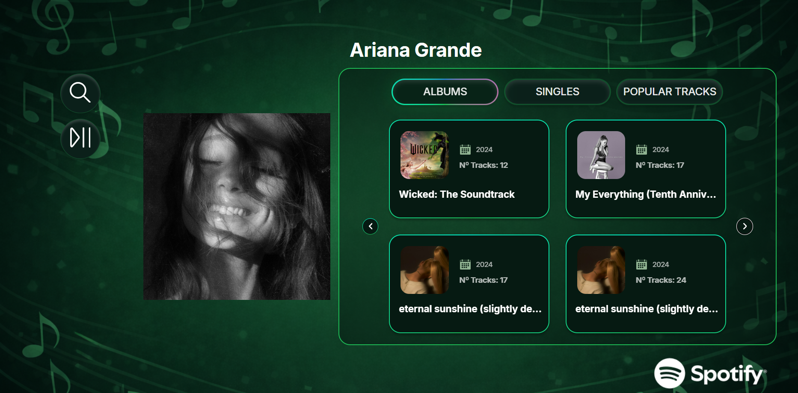
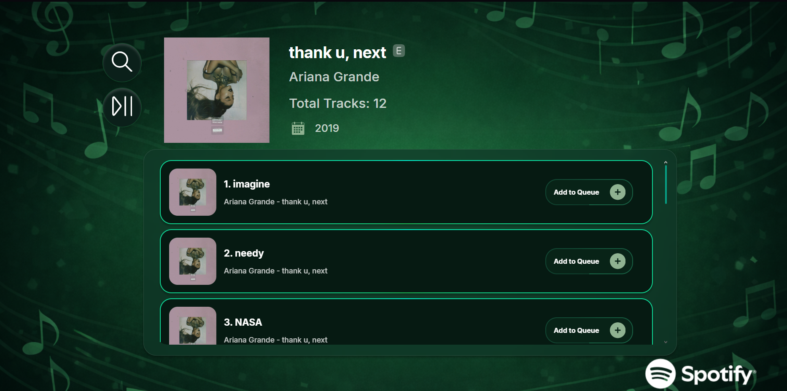
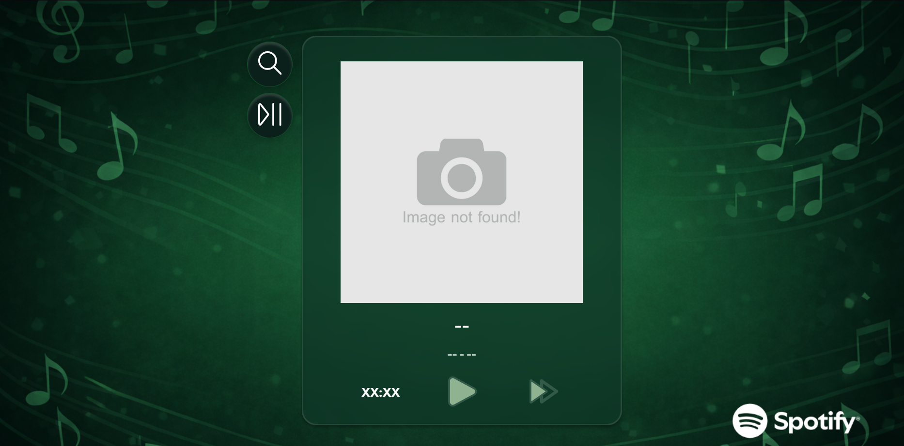
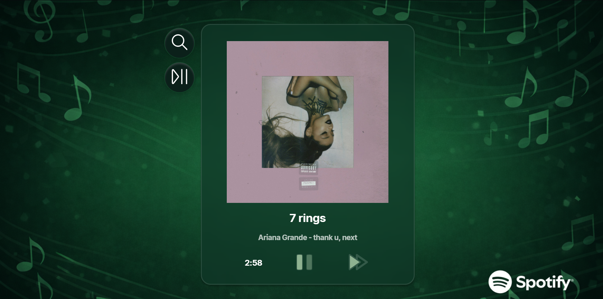

# 🟢 Spotify Playground
General information, tutorials and proyects using the Spotify API to create music-base webpages

API Documentation: https://developer.spotify.com/documentation/web-api <br>
Web Playback SDK: https://developer.spotify.com/documentation/web-playback-sdk <br> <br>

## 📑 Table of Contents
- [Spotify for Developers](#1-spotify-for-developers): introducing the API
- [Quick Start](#2-quick-start): auxiliar files
- [QueuePlayer Application](#3-queueplayer-application): main application of the repository

## 🧩 Spotify for Developers
Spotify for Developers is the Spotify's oficial platform that provides tools, APIs, SDKs, and documentation that allow developers to build applications integrating Spotify’s music streaming features. <br><br>
To access to all features you can log in using your Spotify account, which will let you to use your personal dashboard to create applications using the Spotify API. <br><br>

### ⚙️ 1.1 Creating an App
To create an app you need to specify the following information:
- App's name
- App's description
- Redirect URI: where users can be redirected after authentication success or failure
- Specify all the Spotify API you are going to use in the project
> If you do not need to put a redirect URI use: http://127.0.0.1:3000

>[!Warning] The Spotify Developer's Web do not let the URI to be http://localhost:XXXX. In order to specify your local URI use the http://127.0.0.1

### 🔐 1.2 Request an Access Token
When the app is created, in its information you will see two IDs: _client ID_ and _Client Secret_, which will be used when authenticating credentials (requesting an access token).

To request an access token you have to send a __POST request__ to the token endpoint API with the following structure:
```shell
curl -X POST "https://accounts.spotify.com/api/token" \
     -H "Content-Type: application/x-www-form-urlencoded" \
     -d "grant_type=client_credentials&client_id=your-client-id&client_secret=your-client-secret"
```
The response will return an access token valid for _1 hour_.
```json
{
  "access_token": "access_token",
  "token_type": "Bearer",
  "expires_in": 3600
}
```

With this `access_token` you will be able to do the rest endpoints request to the Spotify Web API.

### ▶️ 1.3 Playback SDK


## 🚀 Quick Start
Before starting to develop a functional web application that uses the Spotify API, it is necessary to first become familiar with how it works. To achieve this, an introductory course on the API was followed through a YouTube tutorial in order to understand the basic principles of using it. The tests carried out can be found in the `Minicourse_Python` folder, and the course/tutorial can be accessed via the following [link](https://www.youtube.com/watch?v=MSBUMMcPnLk).

Additionally, since the goal is to integrate these external API calls into a Spring (Java) application, further research was conducted on how to accomplish this, as it is a topic not covered within the Computer Engineering degree curriculum. All the notes and materials gathered can be found in the `External_API_Requests.ipynb` file.

> [!NOTE] 
> The notes only cover the usage of the `RestTemplate` class in Java, as it is one of the most commonly used tools in this programming language and the one that will be used in the web application to be developed later. Therefore, other libraries have not been covered yet (TBD).


## 🎧 QueuePlayer Application
The QueuePlayer Application (also known as the SpotiApp) is a small music streaming platform similar to Spotify or Apple Music. The app has two basic features: searching for artists, albums, and songs, and playing the songs added to the queue.
> [!WARNING] 
> If you try to test the app by forking the repository, it will not work, as all tokens are stored locally. To see how the app works, you can watch the following YouTube video by clicking this [link](https://youtu.be/nG84TyIVS8U).

The following section presents the two initial features, together with their corresponding screens.

### 🔍 Search Feature
The app’s search functionality is based on Spotify’s Search API endpoint.

Initially, the search bar is empty, as shown below:



When the user enters a search term and presses *Enter* (or clicks the search icon on the right side of the search bar), a REST request is sent to the Spotify API, and the results are displayed across the three available tabs.

For example, if the user searches for "_Ariana Grande_", the first artist result will be Ariana Grande herself, followed by other related artists that would typically appear in Spotify’s own search interface.



Under the Albums tab, some of the artist’s albums will be displayed.



Under the Tracks tab, some of the artist’s songs will be shown (these songs can be added to the playback queue).



> [!NOTE]
> The information returned is not always 100% precise, as this depends on how Spotify processes and ranks search query results.

When the user clicks on an artist, they are taken to the artist’s dedicated page, which contains information about their albums, singles, and popular tracks. This follows a process similar to the search functionality: once the artist’s Spotify ID is obtained, a request is sent to the corresponding Spotify API endpoint to retrieve all this information.

Within the Popular Tracks tab, users can add any of these songs to the playback queue if desired.



Similarly, when the user clicks on an album, they are redirected to its information page, which includes details such as the artist, release year, number of tracks, and whether the album contains explicit content. In addition, the full list of songs from that album is displayed, and any of them can be added to the playback queue.



### ⏯️ Player Feature
On the other hand, the playback queue functionality manages all the songs that are added to the queue and plays them sequentially.

If no song is currently playing, or there are no upcoming songs in the queue, the default player interface is displayed.



When a song is being played, the player shows the album cover, song title, artist name, album name, track duration, and the standard music playback controls.



### 🚧Limitations & Future Improvements
As this project was developed rapidly as a learning prototype to practice working with the Spotify API, some architectural and functional improvements are still pending:

- **DTOs and mappers implementation**: Since the main goal of this project was to practice integrating with the Spotify API, proper web development architecture patterns such as DTOs and object mappers were not fully considered during development. Refactoring the codebase to include these patterns would improve maintainability, scalability, and code clarity.

- __Database concurrency issues__: There is currently a concurrency-related issue affecting database operations that should be addressed to ensure stable and predictable behavior.

- __Playback interruption when leaving the player page__: Music playback stops when the user navigates away from the player page. This is directly related to the current application architecture and should be resolved.

- __Application is not a Single Page Application (SPA)__: The current implementation does not follow an SPA architecture, which negatively impacts user experience and contributes to issues such as playback interruption between page navigations.

- __Missing visual feedback for queue actions__: Songs can be added to the playback queue, but there is currently no visual confirmation or animation to inform the user that the action was successful. Adding UI feedback would significantly improve usability and user experience.